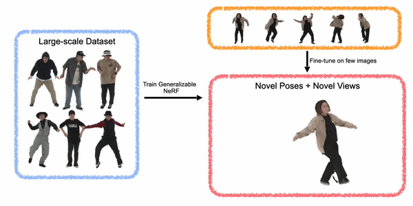

# ActorsNeRF: Animatable Few-shot Human Rendering with Generalizable NeRFs (ICCV 2023)

[**ActorsNeRF: Animatable Few-shot Human Rendering with Generalizable NeRFs (ICCV 2023)**](https://openaccess.thecvf.com/content/ICCV2023/papers/Mu_ActorsNeRF_Animatable_Few-shot_Human_Rendering_with_Generalizable_NeRFs_ICCV_2023_paper.pdf)
<br>
[*JitengMu*](https://jitengmu.github.io/), [*Shen Sang*](https://ssangx.github.io/), [*Nuno Vasconcelos*](http://www.svcl.ucsd.edu/~nuno/), [*Xiaolong Wang*](https://xiaolonw.github.io/)
<br>
ICCV 2023

The project page with more details is at [https://jitengmu.github.io/ActorsNeRF/](https://jitengmu.github.io/ActorsNeRF/).

<div align="center">

</div>


## Citation

If you find our code or method helpful, please use the following BibTex entry.
```
@article{mu2023actorsnerf,
  author    = {Jiteng Mu and
               Shen Sang and
               Nuno Vasconcelos and
               Xiaolong Wang},
  title     = {{ActorsNeRF:} Animatable Few-shot Human Rendering with Generalizable NeRFs},
  booktitle = {ICCV},
  pages = {18391-18401},
  year      = {2023},
}
```
